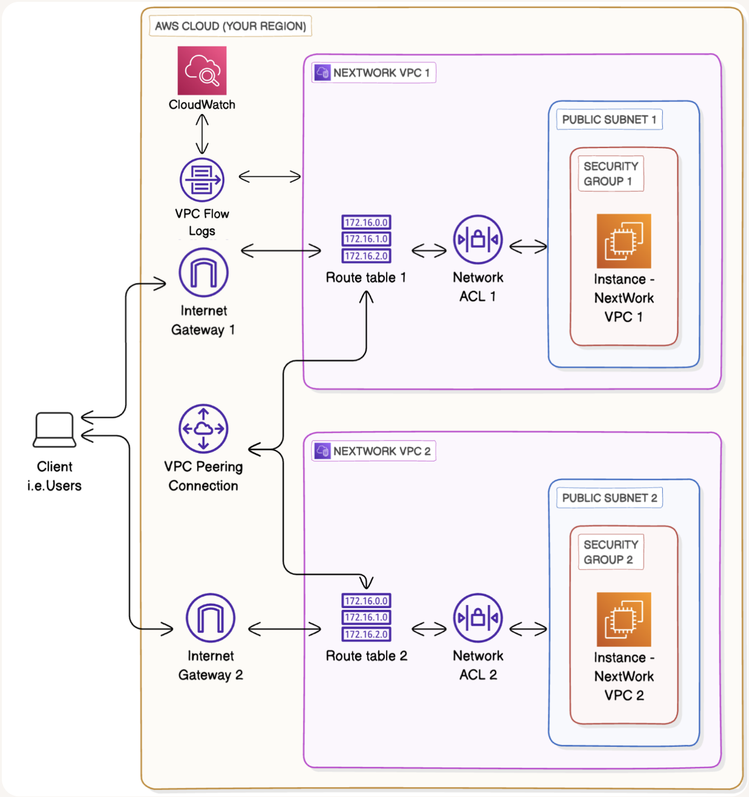

# VPC Monitoring with Flow Logs

**Project Link:** [View Project](http://learn.nextwork.org/projects/aws-networks-monitoring)

**Author:** Adeem Akhtar  
**Email:** adeemakhtar@gmail.com

---

## VPC Monitoring with Flow Logs

---

## Introducing Today's Project!

### What is Amazon VPC?

Amazon VPC is an isolated private network inside the cloud. and it is useful because we can launch our required resources in it.

### How I used Amazon VPC in this project

In today's project, I used Amazon VPC to visualise insights using cloudwatch and flow logs.

### One thing I didn't expect in this project was...

One thing I didn't expect in this project was the assignment of the IAM roles to the flow logs.

### This project took me...

This project took me 45 minutes.

---

## In the first part of my project...

### Step 1 - Set up VPCs

In this step, I will launch two VPCs with a Peering connection, as both VPCs can communicate with each other only through VPC Peering.

### Step 2 - Launch EC2 instances

In this step, I will launch two EC2 instances (one in each subnet).

### Step 3 - Set up Logs

In this step, I will set up a way to track all inbound and outbound network traffic.

Set up a space that stores all of these records.

### Step 4 - Set IAM permissions for Logs

In this step, I will give VPC Flow Logs the permission to write logs and send them to CloudWatch. Because without assigning the IAM role to the flow log, it will not be able to capture and write the log data.

---

## Multi-VPC Architecture

I started my project by launching two VPCs, each with 1 subnet.

The CIDR blocks for VPCs 1 and 2 are 10.1.0.0/16 and 10.2.0.0/16. They have to be unique because we don't want our VPCs to overlap with the IPs.

### I also launched EC2 instances in each subnet

My EC2 instances' security groups allow inbound SSH and  ICMP from anywhere. This is because an SSH rule is required to access the instance for SSH connectivity, and ICMP is required to communicate from one VPC to another VPC.

---

## Logs

Logs are like diaries that record each activity happen to be in the cloud, from the login of a user or an error pop-up.

Log groups are spaces where the related logs are stored for retention, access and analysis.

### I also set up a flow log for VPC 1

---

## IAM Policy and Roles

I created an IAM policy because it will be assigned to the role, which will further be assigned to the flow log.

I also created an IAM role because it is required to assign the IAM policy to any amazon servic.

A custom trust policy is a way to assign the IAM role to a specific service so it can be used specifically by that assigned service.

---

## In the second part of my project...

### Step 5 - Ping testing and troubleshooting

In this step, I will send a message from instance 1 in vpc1 to instance 2 in vpc2 through SSH using the ping command.

### Step 6 - Set up a peering connection

In this step, I will establish a peering connection between VPC 1 and VPC 2.

### Step 7 - Analyze flow logs

In this step, I will review the flow logs recorded about VPC 1's public subnet and analyse the flow logs

---

## Connectivity troubleshooting

My first ping test between my EC2 instances had no replies, which means the request has not reached the requesting instance.

I could receive ping replies if I ran the ping test using the other instance's public IP address, which means instance 1 was successful in communicating to instance 2 through its public IP address through the internet.

---

## Connectivity troubleshooting

Looking at VPC 1's route table, I identified that the ping test with Instance 2's private address failed because there was no direct route towards Instance 2 from the route table of Instance 1 and a missing peering connection.

### To solve this, I set up a peering connection between my VPCs

I also updated both VPCs' route tables so that they could be connected through a peering connection.

---

## Connectivity troubleshooting

I received ping replies from Instance 2's private IP address! This means that Instance 2 and Instance 1 are both connected to each other and communicating through peering connection successfully.

---

## Analyzing flow logs

Flow logs tell us about the format of the log, number of packets sent, port number, source IP, destination IP, bytes of data and the responst "ACCEPT or REJECT"

For example, the flow log I've captured tells us the following:
2 370047118847 eni-01d7371c6a2339e9c 35.203.211.204 10.2.15.162 49785 47254 6 1 44 1776528320 1776528348 REJECT OK

---

## Logs Insights

Logs Insights is a CloudWatch feature that analyses your logs. In Log Insights, you use queries to filter, process and combine data to help you troubleshoot problems or better understand your network traffic!

I ran the query 

fields @timestamp, @message
| sort @timestamp desc
| limit 100

 This query analyses the requests made from my local machine and Instance 1 towards Instance 2.

---

---
