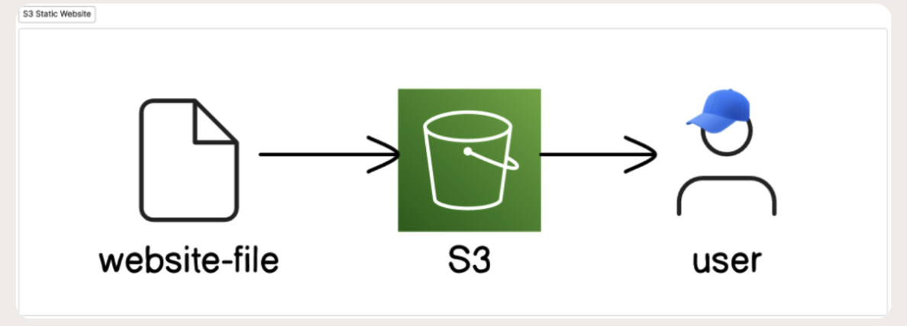
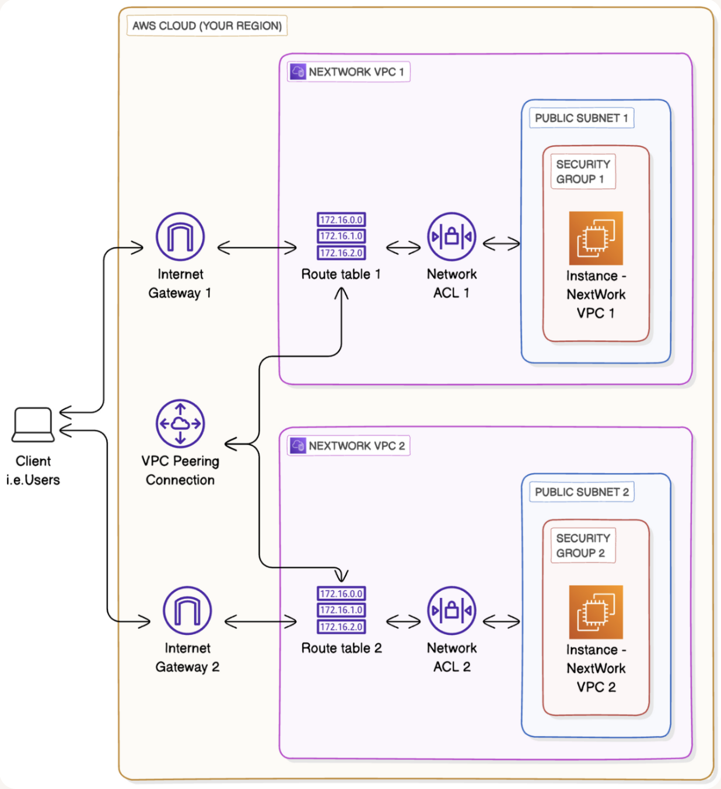

# AWS_Cloud_Networking_Portfolio
All the projects that I have completed on AWS.

## [Project (Part 1): Static Web Hosting on Amazon S3 (Video_Link)](https://drive.google.com/file/d/1GkQ6ABX6ifVz9uYXN_te0txpFTtz4p4L/view?usp=sharing)

* [(Video_Link: https://drive.google.com/file/d/1GkQ6ABX6ifVz9uYXN_te0txpFTtz4p4L/view?usp=sharing)](https://drive.google.com/file/d/1GkQ6ABX6ifVz9uYXN_te0txpFTtz4p4L/view?usp=sharing)

* Configured an Amazon S3 bucket to host a static website, including HTML, CSS, and media assets.
* Enabled static website hosting and set up index and error documents via the AWS Management Console.
* Managed access using bucket policies to allow public read permissions while maintaining secure configuration practices.
* Implemented proper object permissions and file structure to ensure smooth website functionality and accessibility.
* Tested and validated the deployment by accessing the website through the S3 endpoint URL, ensuring reliability and performance.
* Deleted the S3 bucket.

---

## Project (Part 2): Cloud Security with IAM

### Tools, concepts and Services I used were:
1. EC2 
2. IAM
3. Policy Simulator

### Key concepts I learnt include:
1. IAM User
2. IAM Group
3. IAM Roles
4. IAM Policies
5. IAM policy testing

---

## [Project (Part 3): Build a Virtual Private Cloud (Video_Link)](https://drive.google.com/file/d/1TrkS8fLGLnYy5QIaT-mGCQUgsP-2GFDA/view?usp=sharing)

* [(Video_Link: https://drive.google.com/file/d/1TrkS8fLGLnYy5QIaT-mGCQUgsP-2GFDA/view?usp=sharing)](https://drive.google.com/file/d/1TrkS8fLGLnYy5QIaT-mGCQUgsP-2GFDA/view?usp=sharing)

### Services Used:
* Built and deleted the architecture using AWS Management Console and Cloud Shell
* VPC
* Subnet
* Internet Gateway

---

## [Project (Part 4): AWS VPC Traffic Flow and Security (Video_Link)](https://drive.google.com/file/d/1KJet6D-SybEgUqzAENpn_keg070trCXF/view?usp=sharing)

* [(Video_Link: https://drive.google.com/file/d/1KJet6D-SybEgUqzAENpn_keg070trCXF/view?usp=sharing)](https://drive.google.com/file/d/1KJet6D-SybEgUqzAENpn_keg070trCXF/view?usp=sharing)

### Services Used:
* Built and deleted a secure traffic flow architecture with the following services using AWS Management Console and Cloud Shell
* VPC
* Public Subnet
* Internet Gateway
* Route table
* Security Group

---

## [Project (Part 5): AWS Creating a Private Subnet (Video_Link)](https://drive.google.com/file/d/12O8NL8HRHBP1j14VvoEGN-R8bBdu2Opd/view?usp=sharing)

* [(Video_Link: https://drive.google.com/file/d/12O8NL8HRHBP1j14VvoEGN-R8bBdu2Opd/view?usp=sharing)](https://drive.google.com/file/d/12O8NL8HRHBP1j14VvoEGN-R8bBdu2Opd/view?usp=sharing)

### Services Used:
* Built and deleted a secure traffic flow architecture using Public and Private Subnets in AWS VPC with the following services using AWS Management Console
* VPC
* Public and Private Subnets
* Internet Gateway
* Route tables
* Security Groups

---

## [Project (Part 6): Launching Resources in VPC (Video_Link)](https://drive.google.com/file/d/1W7O8szBykElY5jTCEkJ3N9KmKjyRk6SD/view?usp=drive_link)

* [(Video_Link: https://drive.google.com/file/d/1W7O8szBykElY5jTCEkJ3N9KmKjyRk6SD/view?usp=drive_link)](https://drive.google.com/file/d/1W7O8szBykElY5jTCEkJ3N9KmKjyRk6SD/view?usp=drive_link)

### Services Used:
* VPC
* Public and Private Subnets
* Internet Gateway
* Route tables
* Security Groups
* Network Access Control Lists
* EC2

---

## [Project (Part 7): Launching Resources in VPC (Video_Link)](https://drive.google.com/file/d/1NNJqZXGSnFow_rLLjoOiDC6TmALAcRyz/view?usp=sharing)

[(Video_Link: https://drive.google.com/file/d/1NNJqZXGSnFow_rLLjoOiDC6TmALAcRyz/view?usp=sharing)](https://drive.google.com/file/d/1NNJqZXGSnFow_rLLjoOiDC6TmALAcRyz/view?usp=sharing)

### Services Used:
* VPC
* Public and Private Subnets
* Internet Gateway
* Route tables
* Security Groups
* Network Access Control Lists
* EC2
* SSH

---

## [Project (Part 8): VPC Peering (Video_Link)](https://drive.google.com/file/d/1_8hTNr5CoVXkbJEhPIkr6gxRMYO2885M/view?usp=sharing)

[(Video_Link: https://drive.google.com/file/d/1_8hTNr5CoVXkbJEhPIkr6gxRMYO2885M/view?usp=sharing )](https://drive.google.com/file/d/1_8hTNr5CoVXkbJEhPIkr6gxRMYO2885M/view?usp=sharing)

### Services Used:
* VPC
* Public Subnets
* Internet Gateway
* Route tables
* Security Groups
* Network Access Control Lists
* EC2
* SSH
* Elastic IP
* Peering Connection

---

## [Project (Part 9): VPC Monitoring (Video_Link)](https://drive.google.com/file/d/1lhaVYq6rNTD3nfd075n1RYYHYu-Haetr/view?usp=drive_link)

[(Video_Link: https://drive.google.com/file/d/1lhaVYq6rNTD3nfd075n1RYYHYu-Haetr/view?usp=drive_link )](https://drive.google.com/file/d/1lhaVYq6rNTD3nfd075n1RYYHYu-Haetr/view?usp=drive_link)

### Services Used:
* CloudWatch
* FlowLogs
* IAM
* VPC
* Public Subnets
* Internet Gateway
* Route tables
* Security Groups
* Network Access Control Lists
* EC2
* SSH
* Elastic IP
* Peering Connection